I build applied AI and product systems for messy information workflows: RAG, document intelligence, agent workflow state, payout correctness, and backend/product infrastructure.

[Portfolio](https://portfolio-42amps-projects.vercel.app/) · [LinkedIn](https://www.linkedin.com/in/amankhanchandani/) · [Email](mailto:khanchandani.aman2605@gmail.com)

## Building Now

- **Stateframe** - file-first state ledger for long-horizon agent workflows.
- **PayRail** - payout correctness demo with idempotency, ledger accounting, row locks, and state transitions.
- **AI Systems Notes** - technical writing on RAG, agents, document AI, retrieval, and backend correctness.

## Featured Proof

| Project | What it proves | Stack / Focus |
| --- | --- | --- |
| [Stateframe](https://github.com/42amps/stateframe) | Agent workflow state, handoff packets, inspectable task ledgers | TypeScript, CLI, JSON Schema, agents |
| [PayRail](https://github.com/42amps/PayRail) | Backend correctness for payout flows and double-spend prevention | Django, PostgreSQL, React, Docker |
| [AI Systems Notes](https://github.com/42amps/ai-systems-notes) | System-design thinking around applied AI and retrieval | RAG, document AI, evaluation, technical writing |
| [Portfolio](https://github.com/42amps/portfolio) | Recruiter-facing project surface | React, TypeScript, Tailwind |

## I Work With

  

## Secondary / Archive

VRAG, bus-fleet, and Cybersec_Exp are public learning/prototype repos. My main proof-of-work is Stateframe, PayRail, AI Systems Notes, and Portfolio.
